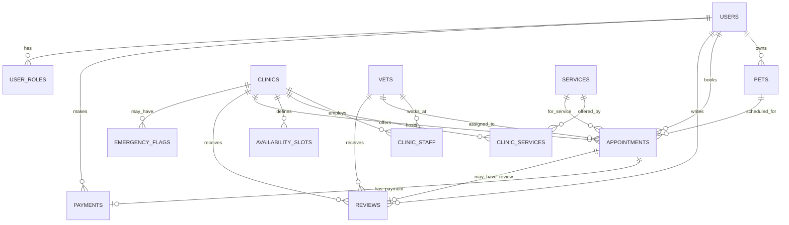

# FindMyVet — Relational Database Schema (Backend Architecture)

This document defines the **relational database schema** for FindMyVet, a veterinary marketplace app supporting:
- Multi-role users (pet owners, vets, clinic staff)
- Pets with species/breed metadata
- Clinics and their veterinarians
- Availability and appointment booking
- Payments and invoicing
- Reviews and ratings
- Emergency flags and urgent care

---

## Entity-Relationship Diagram (Mermaid)



---

## Schema Overview

| Domain | Tables |
|--------|--------|
| Users & Auth | `users`, `user_roles`, `auth_tokens` |
| Pets | `pets`, `species`, `breeds` |
| Clinics & Vets | `clinics`, `vets`, `clinic_staff`, `clinic_hours` |
| Services & Availability | `services`, `clinic_services`, `availability_slots` |
| Appointments | `appointments`, `appointment_status_history` |
| Payments | `payments`, `payment_methods` |
| Reviews | `reviews` |
| Emergency | `emergency_flags` |

---

## 1. Users & Authentication

### `users`
Central user table for all roles (pet owner, vet, clinic admin).

| Column | Type | Constraints | Description |
|--------|------|-------------|-------------|
| `id` | `UUID` | PK, DEFAULT uuid_generate_v4() | Unique user ID |
| `email` | `VARCHAR(255)` | UNIQUE, NOT NULL | Login email |
| `phone` | `VARCHAR(20)` | NULL | Contact phone |
| `password_hash` | `VARCHAR(255)` | NULL | Hashed password (NULL if OAuth/magic link) |
| `first_name` | `VARCHAR(100)` | NOT NULL | |
| `last_name` | `VARCHAR(100)` | NOT NULL | |
| `avatar_url` | `TEXT` | NULL | Profile image |
| `email_verified_at` | `TIMESTAMPTZ` | NULL | |
| `phone_verified_at` | `TIMESTAMPTZ` | NULL | |
| `timezone` | `VARCHAR(50)` | DEFAULT 'America/Los_Angeles' | User's preferred timezone |
| `created_at` | `TIMESTAMPTZ` | DEFAULT NOW() | |
| `updated_at` | `TIMESTAMPTZ` | DEFAULT NOW() | |
| `deleted_at` | `TIMESTAMPTZ` | NULL | Soft delete |

**Indexes:**
- `idx_users_email` ON `email`
- `idx_users_phone` ON `phone`

---

### `user_roles`
Many-to-many: users can have multiple roles (owner + clinic admin, etc.).

| Column | Type | Constraints | Description |
|--------|------|-------------|-------------|
| `id` | `UUID` | PK | |
| `user_id` | `UUID` | FK → users.id, NOT NULL | |
| `role` | `VARCHAR(30)` | NOT NULL | Enum: `pet_owner`, `vet`, `clinic_admin`, `support` |
| `clinic_id` | `UUID` | FK → clinics.id, NULL | Required if role is `vet` or `clinic_admin` |
| `created_at` | `TIMESTAMPTZ` | DEFAULT NOW() | |

**Indexes:**
- `idx_user_roles_user` ON `user_id`
- `idx_user_roles_clinic` ON `clinic_id`
- UNIQUE (`user_id`, `role`, `clinic_id`)

---

### `auth_tokens`
Passwordless / session tokens.

| Column | Type | Constraints | Description |
|--------|------|-------------|-------------|
| `id` | `UUID` | PK | |
| `user_id` | `UUID` | FK → users.id | |
| `token_hash` | `VARCHAR(255)` | NOT NULL | Hashed token |
| `token_type` | `VARCHAR(30)` | NOT NULL | `session`, `magic_link`, `password_reset` |
| `expires_at` | `TIMESTAMPTZ` | NOT NULL | |
| `created_at` | `TIMESTAMPTZ` | DEFAULT NOW() | |
| `revoked_at` | `TIMESTAMPTZ` | NULL | |

---

## 2. Pets

### `species`
Reference table for animal species.

| Column | Type | Constraints | Description |
|--------|------|-------------|-------------|
| `id` | `SERIAL` | PK | |
| `name` | `VARCHAR(50)` | UNIQUE, NOT NULL | e.g., Dog, Cat, Bird, Rabbit |
| `is_active` | `BOOLEAN` | DEFAULT TRUE | |

---

### `breeds`
Reference table for breeds (optional granularity).

| Column | Type | Constraints | Description |
|--------|------|-------------|-------------|
| `id` | `SERIAL` | PK | |
| `species_id` | `INT` | FK → species.id | |
| `name` | `VARCHAR(100)` | NOT NULL | e.g., Labrador Retriever |

**Index:** `idx_breeds_species` ON `species_id`

---

### `pets`
Pet profiles owned by users.

| Column | Type | Constraints | Description |
|--------|------|-------------|-------------|
| `id` | `UUID` | PK | |
| `owner_id` | `UUID` | FK → users.id, NOT NULL | |
| `name` | `VARCHAR(100)` | NOT NULL | |
| `species_id` | `INT` | FK → species.id, NOT NULL | |
| `breed_id` | `INT` | FK → breeds.id, NULL | |
| `date_of_birth` | `DATE` | NULL | |
| `weight_kg` | `DECIMAL(5,2)` | NULL | |
| `sex` | `VARCHAR(10)` | NULL | `male`, `female`, `unknown` |
| `is_neutered` | `BOOLEAN` | NULL | |
| `photo_url` | `TEXT` | NULL | |
| `notes` | `TEXT` | NULL | Allergies, temperament, etc. |
| `created_at` | `TIMESTAMPTZ` | DEFAULT NOW() | |
| `updated_at` | `TIMESTAMPTZ` | DEFAULT NOW() | |
| `deleted_at` | `TIMESTAMPTZ` | NULL | Soft delete |

**Indexes:**
- `idx_pets_owner` ON `owner_id`
- `idx_pets_species` ON `species_id`

---

## 3. Clinics & Vets

### `clinics`
Veterinary clinic / practice.

| Column | Type | Constraints | Description |
|--------|------|-------------|-------------|
| `id` | `UUID` | PK | |
| `name` | `VARCHAR(200)` | NOT NULL | |
| `slug` | `VARCHAR(200)` | UNIQUE, NOT NULL | URL-friendly identifier |
| `description` | `TEXT` | NULL | |
| `phone` | `VARCHAR(20)` | NOT NULL | |
| `email` | `VARCHAR(255)` | NULL | |
| `website_url` | `TEXT` | NULL | |
| `logo_url` | `TEXT` | NULL | |
| `address_line1` | `VARCHAR(255)` | NOT NULL | |
| `address_line2` | `VARCHAR(255)` | NULL | |
| `city` | `VARCHAR(100)` | NOT NULL | |
| `state` | `VARCHAR(50)` | NOT NULL | |
| `postal_code` | `VARCHAR(20)` | NOT NULL | |
| `country` | `VARCHAR(50)` | DEFAULT 'US' | |
| `latitude` | `DECIMAL(10,7)` | NOT NULL | For geo search |
| `longitude` | `DECIMAL(10,7)` | NOT NULL | |
| `timezone` | `VARCHAR(50)` | NOT NULL | |
| `cancellation_policy` | `TEXT` | NULL | |
| `parking_notes` | `TEXT` | NULL | |
| `accepts_emergency` | `BOOLEAN` | DEFAULT FALSE | Does clinic handle emergencies? |
| `home_visit_enabled` | `BOOLEAN` | DEFAULT FALSE | |
| `home_visit_radius_km` | `DECIMAL(5,2)` | NULL | Service area for home visits |
| `is_active` | `BOOLEAN` | DEFAULT TRUE | |
| `created_at` | `TIMESTAMPTZ` | DEFAULT NOW() | |
| `updated_at` | `TIMESTAMPTZ` | DEFAULT NOW() | |

**Indexes:**
- `idx_clinics_slug` ON `slug`
- `idx_clinics_geo` ON `latitude`, `longitude`
- `idx_clinics_city_state` ON `city`, `state`
- `idx_clinics_postal` ON `postal_code`

---

### `clinic_hours`
Operating hours per day of week.

| Column | Type | Constraints | Description |
|--------|------|-------------|-------------|
| `id` | `UUID` | PK | |
| `clinic_id` | `UUID` | FK → clinics.id, NOT NULL | |
| `day_of_week` | `SMALLINT` | NOT NULL | 0=Sunday, 6=Saturday |
| `open_time` | `TIME` | NOT NULL | |
| `close_time` | `TIME` | NOT NULL | |
| `is_closed` | `BOOLEAN` | DEFAULT FALSE | Override: closed this day |

**Index:** UNIQUE (`clinic_id`, `day_of_week`)

---

### `vets`
Veterinarian profiles (linked to user accounts).

| Column | Type | Constraints | Description |
|--------|------|-------------|-------------|
| `id` | `UUID` | PK | |
| `user_id` | `UUID` | FK → users.id, UNIQUE, NOT NULL | Vet's user account |
| `license_number` | `VARCHAR(100)` | NULL | State license |
| `license_state` | `VARCHAR(50)` | NULL | |
| `specialty` | `VARCHAR(100)` | NULL | e.g., Surgery, Dermatology |
| `years_experience` | `INT` | NULL | |
| `bio` | `TEXT` | NULL | |
| `photo_url` | `TEXT` | NULL | |
| `is_verified` | `BOOLEAN` | DEFAULT FALSE | Admin-verified credentials |
| `created_at` | `TIMESTAMPTZ` | DEFAULT NOW() | |
| `updated_at` | `TIMESTAMPTZ` | DEFAULT NOW() | |

---

### `clinic_staff`
Many-to-many: vets (and other staff) ↔ clinics.

| Column | Type | Constraints | Description |
|--------|------|-------------|-------------|
| `id` | `UUID` | PK | |
| `clinic_id` | `UUID` | FK → clinics.id, NOT NULL | |
| `vet_id` | `UUID` | FK → vets.id, NULL | NULL if non-vet staff |
| `user_id` | `UUID` | FK → users.id, NOT NULL | Staff user account |
| `role` | `VARCHAR(30)` | NOT NULL | `vet`, `admin`, `receptionist` |
| `is_primary` | `BOOLEAN` | DEFAULT FALSE | Primary contact for clinic |
| `created_at` | `TIMESTAMPTZ` | DEFAULT NOW() | |
| `removed_at` | `TIMESTAMPTZ` | NULL | |

**Indexes:**
- `idx_clinic_staff_clinic` ON `clinic_id`
- `idx_clinic_staff_vet` ON `vet_id`
- UNIQUE (`clinic_id`, `user_id`)

---

## 4. Services & Availability

### `services`
Global service catalog (system-defined).

| Column | Type | Constraints | Description |
|--------|------|-------------|-------------|
| `id` | `SERIAL` | PK | |
| `name` | `VARCHAR(100)` | UNIQUE, NOT NULL | e.g., General Exam |
| `slug` | `VARCHAR(100)` | UNIQUE, NOT NULL | |
| `description` | `TEXT` | NULL | |
| `default_duration_min` | `INT` | DEFAULT 30 | |
| `is_emergency` | `BOOLEAN` | DEFAULT FALSE | Emergency service type |
| `supports_home_visit` | `BOOLEAN` | DEFAULT FALSE | |
| `is_active` | `BOOLEAN` | DEFAULT TRUE | |

**Seed data:**
- General Exam
- Vaccination
- Sick Visit
- Dental Cleaning
- Surgery Consult
- Emergency Visit
- Home Visit — General

---

### `clinic_services`
Services offered by a specific clinic (with pricing/duration overrides).

| Column | Type | Constraints | Description |
|--------|------|-------------|-------------|
| `id` | `UUID` | PK | |
| `clinic_id` | `UUID` | FK → clinics.id, NOT NULL | |
| `service_id` | `INT` | FK → services.id, NOT NULL | |
| `duration_min` | `INT` | NOT NULL | Clinic-specific duration |
| `price_cents` | `INT` | NULL | "Starting at" price (optional) |
| `is_active` | `BOOLEAN` | DEFAULT TRUE | |
| `created_at` | `TIMESTAMPTZ` | DEFAULT NOW() | |

**Index:** UNIQUE (`clinic_id`, `service_id`)

---

### `availability_slots`
Pre-generated or rule-based bookable slots.

| Column | Type | Constraints | Description |
|--------|------|-------------|-------------|
| `id` | `UUID` | PK | |
| `clinic_id` | `UUID` | FK → clinics.id, NOT NULL | |
| `vet_id` | `UUID` | FK → vets.id, NULL | NULL = any available vet |
| `service_id` | `INT` | FK → services.id, NULL | NULL = any service |
| `slot_date` | `DATE` | NOT NULL | |
| `start_time` | `TIME` | NOT NULL | |
| `end_time` | `TIME` | NOT NULL | |
| `slot_type` | `VARCHAR(20)` | DEFAULT 'in_person' | `in_person`, `home_visit` |
| `max_bookings` | `INT` | DEFAULT 1 | Concurrent bookings allowed |
| `current_bookings` | `INT` | DEFAULT 0 | Counter (denormalized for speed) |
| `is_blocked` | `BOOLEAN` | DEFAULT FALSE | Manually blocked (blackout) |
| `created_at` | `TIMESTAMPTZ` | DEFAULT NOW() | |

**Indexes:**
- `idx_slots_clinic_date` ON `clinic_id`, `slot_date`
- `idx_slots_available` ON `clinic_id`, `slot_date`, `is_blocked` WHERE `current_bookings < max_bookings`
- `idx_slots_vet` ON `vet_id`

---

## 5. Appointments

### `appointments`
Core booking record.

| Column | Type | Constraints | Description |
|--------|------|-------------|-------------|
| `id` | `UUID` | PK | |
| `confirmation_code` | `VARCHAR(12)` | UNIQUE, NOT NULL | Human-readable code |
| `clinic_id` | `UUID` | FK → clinics.id, NOT NULL | |
| `slot_id` | `UUID` | FK → availability_slots.id, NULL | NULL if free-form booking |
| `owner_id` | `UUID` | FK → users.id, NOT NULL | Pet owner |
| `pet_id` | `UUID` | FK → pets.id, NOT NULL | |
| `vet_id` | `UUID` | FK → vets.id, NULL | Assigned vet (may be NULL until confirmed) |
| `service_id` | `INT` | FK → services.id, NOT NULL | |
| `appointment_type` | `VARCHAR(20)` | NOT NULL | `in_person`, `home_visit` |
| `scheduled_date` | `DATE` | NOT NULL | |
| `scheduled_start` | `TIME` | NOT NULL | |
| `scheduled_end` | `TIME` | NOT NULL | |
| `home_address_line1` | `VARCHAR(255)` | NULL | For home visits |
| `home_address_line2` | `VARCHAR(255)` | NULL | |
| `home_city` | `VARCHAR(100)` | NULL | |
| `home_state` | `VARCHAR(50)` | NULL | |
| `home_postal_code` | `VARCHAR(20)` | NULL | |
| `home_access_notes` | `TEXT` | NULL | Gate code, parking, etc. |
| `owner_notes` | `TEXT` | NULL | Symptoms, concerns |
| `clinic_notes` | `TEXT` | NULL | Internal notes |
| `status` | `VARCHAR(30)` | NOT NULL, DEFAULT 'booked' | See enum below |
| `is_emergency` | `BOOLEAN` | DEFAULT FALSE | |
| `cancelled_by` | `UUID` | FK → users.id, NULL | Who cancelled |
| `cancellation_reason` | `TEXT` | NULL | |
| `cancelled_at` | `TIMESTAMPTZ` | NULL | |
| `reminder_sent_at` | `TIMESTAMPTZ` | NULL | |
| `created_at` | `TIMESTAMPTZ` | DEFAULT NOW() | |
| `updated_at` | `TIMESTAMPTZ` | DEFAULT NOW() | |

**Status enum values:**
- `booked` — confirmed
- `rescheduled` — moved to new time
- `cancelled_by_owner`
- `cancelled_by_clinic`
- `no_show`
- `completed`

**Indexes:**
- `idx_appts_owner` ON `owner_id`
- `idx_appts_clinic_date` ON `clinic_id`, `scheduled_date`
- `idx_appts_vet_date` ON `vet_id`, `scheduled_date`
- `idx_appts_status` ON `status`
- `idx_appts_confirmation` ON `confirmation_code`

---

### `appointment_status_history`
Audit log for status changes.

| Column | Type | Constraints | Description |
|--------|------|-------------|-------------|
| `id` | `UUID` | PK | |
| `appointment_id` | `UUID` | FK → appointments.id, NOT NULL | |
| `previous_status` | `VARCHAR(30)` | NULL | |
| `new_status` | `VARCHAR(30)` | NOT NULL | |
| `changed_by` | `UUID` | FK → users.id, NULL | NULL = system |
| `reason` | `TEXT` | NULL | |
| `created_at` | `TIMESTAMPTZ` | DEFAULT NOW() | |

**Index:** `idx_appt_history_appt` ON `appointment_id`

---

## 6. Payments

### `payment_methods`
Stored payment methods (tokenized).

| Column | Type | Constraints | Description |
|--------|------|-------------|-------------|
| `id` | `UUID` | PK | |
| `user_id` | `UUID` | FK → users.id, NOT NULL | |
| `provider` | `VARCHAR(30)` | NOT NULL | `stripe`, `square`, etc. |
| `provider_token` | `VARCHAR(255)` | NOT NULL | Tokenized card/account |
| `card_last4` | `VARCHAR(4)` | NULL | |
| `card_brand` | `VARCHAR(20)` | NULL | `visa`, `mastercard`, etc. |
| `card_exp_month` | `SMALLINT` | NULL | |
| `card_exp_year` | `SMALLINT` | NULL | |
| `is_default` | `BOOLEAN` | DEFAULT FALSE | |
| `created_at` | `TIMESTAMPTZ` | DEFAULT NOW() | |
| `deleted_at` | `TIMESTAMPTZ` | NULL | Soft delete |

**Index:** `idx_payment_methods_user` ON `user_id`

---

### `payments`
Payment transactions for appointments.

| Column | Type | Constraints | Description |
|--------|------|-------------|-------------|
| `id` | `UUID` | PK | |
| `appointment_id` | `UUID` | FK → appointments.id, NOT NULL | |
| `user_id` | `UUID` | FK → users.id, NOT NULL | Payer |
| `payment_method_id` | `UUID` | FK → payment_methods.id, NULL | |
| `amount_cents` | `INT` | NOT NULL | Total charged |
| `currency` | `VARCHAR(3)` | DEFAULT 'USD' | |
| `status` | `VARCHAR(30)` | NOT NULL | `pending`, `succeeded`, `failed`, `refunded` |
| `provider` | `VARCHAR(30)` | NOT NULL | `stripe`, `square` |
| `provider_payment_id` | `VARCHAR(255)` | NULL | External reference |
| `provider_refund_id` | `VARCHAR(255)` | NULL | |
| `refund_amount_cents` | `INT` | DEFAULT 0 | |
| `failure_reason` | `TEXT` | NULL | |
| `paid_at` | `TIMESTAMPTZ` | NULL | |
| `refunded_at` | `TIMESTAMPTZ` | NULL | |
| `created_at` | `TIMESTAMPTZ` | DEFAULT NOW() | |
| `updated_at` | `TIMESTAMPTZ` | DEFAULT NOW() | |

**Indexes:**
- `idx_payments_appointment` ON `appointment_id`
- `idx_payments_user` ON `user_id`
- `idx_payments_status` ON `status`

---

## 7. Reviews

### `reviews`
Post-appointment reviews (owner → clinic/vet).

| Column | Type | Constraints | Description |
|--------|------|-------------|-------------|
| `id` | `UUID` | PK | |
| `appointment_id` | `UUID` | FK → appointments.id, UNIQUE, NOT NULL | One review per appointment |
| `reviewer_id` | `UUID` | FK → users.id, NOT NULL | Pet owner |
| `clinic_id` | `UUID` | FK → clinics.id, NOT NULL | |
| `vet_id` | `UUID` | FK → vets.id, NULL | If reviewing specific vet |
| `rating` | `SMALLINT` | NOT NULL, CHECK (1-5) | 1–5 stars |
| `title` | `VARCHAR(200)` | NULL | |
| `body` | `TEXT` | NULL | |
| `is_published` | `BOOLEAN` | DEFAULT TRUE | Moderation flag |
| `clinic_response` | `TEXT` | NULL | Clinic reply |
| `clinic_responded_at` | `TIMESTAMPTZ` | NULL | |
| `created_at` | `TIMESTAMPTZ` | DEFAULT NOW() | |
| `updated_at` | `TIMESTAMPTZ` | DEFAULT NOW() | |

**Indexes:**
- `idx_reviews_clinic` ON `clinic_id`
- `idx_reviews_vet` ON `vet_id`
- `idx_reviews_rating` ON `rating`

---

## 8. Emergency Flags

### `emergency_flags`
Real-time emergency status for clinics.

| Column | Type | Constraints | Description |
|--------|------|-------------|-------------|
| `id` | `UUID` | PK | |
| `clinic_id` | `UUID` | FK → clinics.id, NOT NULL | |
| `flag_type` | `VARCHAR(30)` | NOT NULL | `accepting_emergency`, `at_capacity`, `closed_emergency` |
| `message` | `TEXT` | NULL | Custom message (e.g., "ER wait: 2 hrs") |
| `started_at` | `TIMESTAMPTZ` | DEFAULT NOW() | |
| `expires_at` | `TIMESTAMPTZ` | NULL | Auto-clear after this time |
| `created_by` | `UUID` | FK → users.id, NOT NULL | Clinic staff who set it |
| `is_active` | `BOOLEAN` | DEFAULT TRUE | |
| `created_at` | `TIMESTAMPTZ` | DEFAULT NOW() | |

**Index:** `idx_emergency_flags_clinic_active` ON `clinic_id`, `is_active`

---

## Relationships Summary

| Parent | Child | Relationship | FK Column |
|--------|-------|--------------|-----------|
| `users` | `pets` | 1:N | `pets.owner_id` |
| `users` | `user_roles` | 1:N | `user_roles.user_id` |
| `users` | `vets` | 1:1 | `vets.user_id` |
| `users` | `appointments` | 1:N | `appointments.owner_id` |
| `users` | `reviews` | 1:N | `reviews.reviewer_id` |
| `users` | `payments` | 1:N | `payments.user_id` |
| `users` | `payment_methods` | 1:N | `payment_methods.user_id` |
| `clinics` | `clinic_hours` | 1:N | `clinic_hours.clinic_id` |
| `clinics` | `clinic_staff` | 1:N | `clinic_staff.clinic_id` |
| `clinics` | `clinic_services` | 1:N | `clinic_services.clinic_id` |
| `clinics` | `availability_slots` | 1:N | `availability_slots.clinic_id` |
| `clinics` | `appointments` | 1:N | `appointments.clinic_id` |
| `clinics` | `reviews` | 1:N | `reviews.clinic_id` |
| `clinics` | `emergency_flags` | 1:N | `emergency_flags.clinic_id` |
| `vets` | `clinic_staff` | 1:N | `clinic_staff.vet_id` |
| `vets` | `appointments` | 1:N | `appointments.vet_id` |
| `vets` | `availability_slots` | 1:N | `availability_slots.vet_id` |
| `vets` | `reviews` | 1:N | `reviews.vet_id` |
| `services` | `clinic_services` | 1:N | `clinic_services.service_id` |
| `services` | `appointments` | 1:N | `appointments.service_id` |
| `pets` | `appointments` | 1:N | `appointments.pet_id` |
| `appointments` | `payments` | 1:1 | `payments.appointment_id` |
| `appointments` | `reviews` | 1:1 | `reviews.appointment_id` |
| `appointments` | `appointment_status_history` | 1:N | `...appointment_id` |
| `species` | `breeds` | 1:N | `breeds.species_id` |
| `species` | `pets` | 1:N | `pets.species_id` |

---

## Example SQL: Create Core Tables (PostgreSQL)

```sql
-- Enable UUID extension
CREATE EXTENSION IF NOT EXISTS "uuid-ossp";

-- Users
CREATE TABLE users (
    id              UUID PRIMARY KEY DEFAULT uuid_generate_v4(),
    email           VARCHAR(255) UNIQUE NOT NULL,
    phone           VARCHAR(20),
    password_hash   VARCHAR(255),
    first_name      VARCHAR(100) NOT NULL,
    last_name       VARCHAR(100) NOT NULL,
    avatar_url      TEXT,
    email_verified_at TIMESTAMPTZ,
    phone_verified_at TIMESTAMPTZ,
    timezone        VARCHAR(50) DEFAULT 'America/Los_Angeles',
    created_at      TIMESTAMPTZ DEFAULT NOW(),
    updated_at      TIMESTAMPTZ DEFAULT NOW(),
    deleted_at      TIMESTAMPTZ
);
CREATE INDEX idx_users_email ON users(email);

-- Clinics
CREATE TABLE clinics (
    id              UUID PRIMARY KEY DEFAULT uuid_generate_v4(),
    name            VARCHAR(200) NOT NULL,
    slug            VARCHAR(200) UNIQUE NOT NULL,
    description     TEXT,
    phone           VARCHAR(20) NOT NULL,
    email           VARCHAR(255),
    website_url     TEXT,
    logo_url        TEXT,
    address_line1   VARCHAR(255) NOT NULL,
    address_line2   VARCHAR(255),
    city            VARCHAR(100) NOT NULL,
    state           VARCHAR(50) NOT NULL,
    postal_code     VARCHAR(20) NOT NULL,
    country         VARCHAR(50) DEFAULT 'US',
    latitude        DECIMAL(10,7) NOT NULL,
    longitude       DECIMAL(10,7) NOT NULL,
    timezone        VARCHAR(50) NOT NULL,
    cancellation_policy TEXT,
    parking_notes   TEXT,
    accepts_emergency BOOLEAN DEFAULT FALSE,
    home_visit_enabled BOOLEAN DEFAULT FALSE,
    home_visit_radius_km DECIMAL(5,2),
    is_active       BOOLEAN DEFAULT TRUE,
    created_at      TIMESTAMPTZ DEFAULT NOW(),
    updated_at      TIMESTAMPTZ DEFAULT NOW()
);
CREATE INDEX idx_clinics_geo ON clinics(latitude, longitude);
CREATE INDEX idx_clinics_postal ON clinics(postal_code);

-- Appointments
CREATE TABLE appointments (
    id                  UUID PRIMARY KEY DEFAULT uuid_generate_v4(),
    confirmation_code   VARCHAR(12) UNIQUE NOT NULL,
    clinic_id           UUID NOT NULL REFERENCES clinics(id),
    slot_id             UUID,  -- FK added after availability_slots created
    owner_id            UUID NOT NULL REFERENCES users(id),
    pet_id              UUID NOT NULL,  -- FK added after pets created
    vet_id              UUID,           -- FK added after vets created
    service_id          INT NOT NULL,   -- FK added after services created
    appointment_type    VARCHAR(20) NOT NULL,
    scheduled_date      DATE NOT NULL,
    scheduled_start     TIME NOT NULL,
    scheduled_end       TIME NOT NULL,
    home_address_line1  VARCHAR(255),
    home_address_line2  VARCHAR(255),
    home_city           VARCHAR(100),
    home_state          VARCHAR(50),
    home_postal_code    VARCHAR(20),
    home_access_notes   TEXT,
    owner_notes         TEXT,
    clinic_notes        TEXT,
    status              VARCHAR(30) NOT NULL DEFAULT 'booked',
    is_emergency        BOOLEAN DEFAULT FALSE,
    cancelled_by        UUID REFERENCES users(id),
    cancellation_reason TEXT,
    cancelled_at        TIMESTAMPTZ,
    reminder_sent_at    TIMESTAMPTZ,
    created_at          TIMESTAMPTZ DEFAULT NOW(),
    updated_at          TIMESTAMPTZ DEFAULT NOW()
);
CREATE INDEX idx_appts_clinic_date ON appointments(clinic_id, scheduled_date);
CREATE INDEX idx_appts_owner ON appointments(owner_id);
CREATE INDEX idx_appts_status ON appointments(status);

-- Payments
CREATE TABLE payments (
    id                  UUID PRIMARY KEY DEFAULT uuid_generate_v4(),
    appointment_id      UUID NOT NULL REFERENCES appointments(id),
    user_id             UUID NOT NULL REFERENCES users(id),
    payment_method_id   UUID,
    amount_cents        INT NOT NULL,
    currency            VARCHAR(3) DEFAULT 'USD',
    status              VARCHAR(30) NOT NULL,
    provider            VARCHAR(30) NOT NULL,
    provider_payment_id VARCHAR(255),
    provider_refund_id  VARCHAR(255),
    refund_amount_cents INT DEFAULT 0,
    failure_reason      TEXT,
    paid_at             TIMESTAMPTZ,
    refunded_at         TIMESTAMPTZ,
    created_at          TIMESTAMPTZ DEFAULT NOW(),
    updated_at          TIMESTAMPTZ DEFAULT NOW()
);
CREATE INDEX idx_payments_appointment ON payments(appointment_id);

-- Reviews
CREATE TABLE reviews (
    id                  UUID PRIMARY KEY DEFAULT uuid_generate_v4(),
    appointment_id      UUID UNIQUE NOT NULL REFERENCES appointments(id),
    reviewer_id         UUID NOT NULL REFERENCES users(id),
    clinic_id           UUID NOT NULL REFERENCES clinics(id),
    vet_id              UUID,
    rating              SMALLINT NOT NULL CHECK (rating >= 1 AND rating <= 5),
    title               VARCHAR(200),
    body                TEXT,
    is_published        BOOLEAN DEFAULT TRUE,
    clinic_response     TEXT,
    clinic_responded_at TIMESTAMPTZ,
    created_at          TIMESTAMPTZ DEFAULT NOW(),
    updated_at          TIMESTAMPTZ DEFAULT NOW()
);
CREATE INDEX idx_reviews_clinic ON reviews(clinic_id);

-- Emergency Flags
CREATE TABLE emergency_flags (
    id          UUID PRIMARY KEY DEFAULT uuid_generate_v4(),
    clinic_id   UUID NOT NULL REFERENCES clinics(id),
    flag_type   VARCHAR(30) NOT NULL,
    message     TEXT,
    started_at  TIMESTAMPTZ DEFAULT NOW(),
    expires_at  TIMESTAMPTZ,
    created_by  UUID NOT NULL REFERENCES users(id),
    is_active   BOOLEAN DEFAULT TRUE,
    created_at  TIMESTAMPTZ DEFAULT NOW()
);
CREATE INDEX idx_emergency_flags_clinic_active ON emergency_flags(clinic_id, is_active);
```

---

## Design Notes

1. **UUIDs everywhere** — safer for distributed systems, no leaking row counts.
2. **Soft deletes** — `deleted_at` on users/pets/payment_methods for data retention compliance.
3. **Denormalized counters** — `availability_slots.current_bookings` avoids COUNT queries on hot path; updated transactionally.
4. **Timezone-aware** — all timestamps are `TIMESTAMPTZ`; clinics + users store preferred timezone for display.
5. **Extensibility** — `services` is a global catalog; clinics customize via `clinic_services`.
6. **Emergency flags** — separate table allows real-time status updates without modifying `clinics`.
7. **Status history** — audit trail for compliance and customer support.

---

## Next Steps (post-MVP)
- Add `clinic_photos`, `vet_certifications`, `insurance_providers` tables.
- Implement full-text search on clinic name/description.
- Add geo-spatial indexing (PostGIS) for radius queries.
- Introduce `waitlist` table for fully-booked slots.
- Add `notifications` table for push/email tracking.

